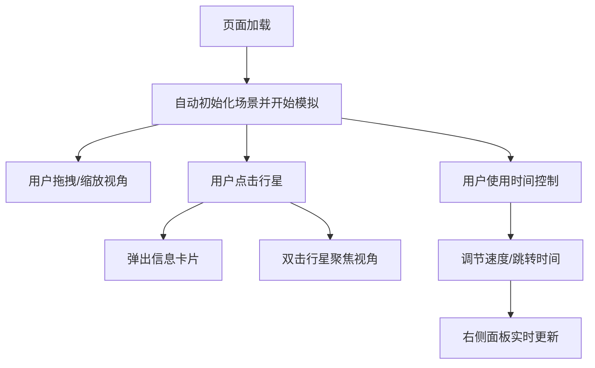

## 1. 产品概述

基于 Three.js 的交互式 3D 太阳系行星运行模拟器，用于科学教育和天文爱好者可视化观察太阳系天体运动规律。

- 核心价值：真实还原太阳系行星运动轨迹，支持多维度交互探索
- 目标用户：学生、教师、天文爱好者、科普工作者

## 2. 核心特性

### 2.1 功能模块
1. **主场景（3D 太阳系）**：太阳、8 大行星、土星环、椭圆轨道线、星空背景
2. **交互控制**：视角自由操控、行星点击信息卡片、双击视角聚焦
3. **时间控制**：播放/暂停/快进/快退、速度调节（1x/10x/100x/1000x）、时间轴拖拽
4. **数据面板**：右侧实时轨道参数、底部 2D 轨道缩略图

### 2.2 页面详情

| 页面名称 | 模块名称 | 功能描述 |
|-----------|-------------|---------------------|
| 主页 | 3D 场景渲染 | Three.js 渲染太阳、行星、轨道、星空粒子 |
| 主页 | 行星信息卡片 | 点击行星弹出：名称、质量、直径、距日距离、公转周期、有趣事实 |
| 主页 | 时间控制栏 | 播放/暂停、前进/后退按钮、速度切换、时间轴滑块 |
| 主页 | 右侧数据面板 | 选中行星的轨道参数、当前速度、距太阳距离 |
| 主页 | 底部 2D 轨道图 | Canvas 绘制俯视角度轨道图，标注各行星位置 |

## 3. 核心流程

用户进入页面后自动开始模拟运行 → 可通过鼠标拖拽旋转/缩放视角 → 点击行星查看详细信息 → 双击行星聚焦视角 → 使用底部时间控制调节模拟速度和时间点 → 右侧面板实时更新数据

## 4. 用户界面设计

### 4.1 设计风格
- **主色调**：深邃宇宙黑 (#0a0a1a) + 星空蓝 (#1a1a3a) + 太阳金 (#ffcc33)
- **辅助色**：各行星代表色（水星灰、金星橙、地球蓝、火星红、木星棕、土星黄、天王青、海王蓝）
- **字体**：Orbitron（显示字体）+ JetBrains Mono（数据字体）
- **按钮风格**：半透明玻璃拟态 (glassmorphism)，圆角 8px，边框微光
- **布局**：全屏 3D 场景 + 右侧悬浮数据面板 + 底部时间控制栏
- **图标**：使用 Lucide 图标，线性风格

### 4.2 页面设计概览

| 页面名称 | 模块名称 | UI 元素 |
|-----------|-------------|-------------|
| 主页 | 3D 场景 | 全屏 Canvas、太阳发光体、行星纹理、椭圆轨道线、星空粒子 |
| 主页 | 信息卡片 | 玻璃拟态卡片、行星名称、参数列表、有趣事实段落 |
| 主页 | 时间控制栏 | 半透明深色条、圆形按钮、速度标签组、时间轴滑块 |
| 主页 | 右侧数据面板 | 半透明面板、标题、参数键值对、实时数值高亮 |
| 主页 | 2D 轨道图 | Canvas 俯视图、彩色轨道线、行星位置点、标注文字 |

### 4.3 响应式设计
- 桌面端：完整布局，右侧面板 320px 宽，底部控制栏 100% 宽
- 平板端：右侧面板可折叠，控制栏自适应
- 移动端：触摸手势优化，面板折叠为底部抽屉

### 4.4 3D 场景指导
- **环境**：纯黑背景 + 数千颗随机星空粒子
- **光照**：太阳为 PointLight（点光源）自发光，行星仅受太阳照射
- **相机**：PerspectiveCamera，初始位置俯视太阳系，fov 60°
- **交互**：OrbitControls，支持阻尼效果
- **后期**：Bloom 发光效果（太阳和行星光晕）
- **资源**：所有纹理程序化 Canvas 生成，无需外部资源
