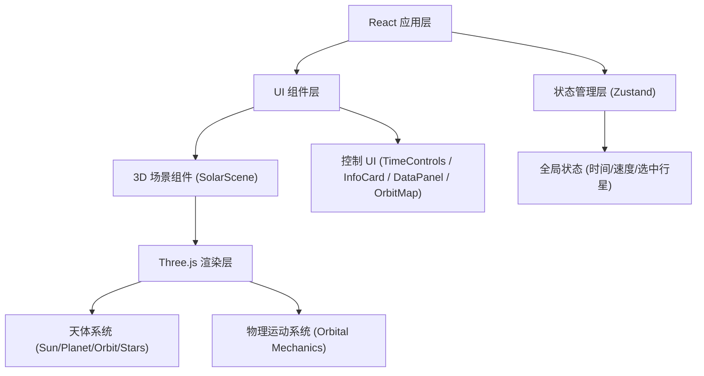

## 1. 架构设计



## 2. 技术说明

- **前端框架**：React@18 + TypeScript + Vite
- **3D 渲染**：three@0.160 + @react-three/fiber@8 + @react-three/drei@9 + @react-three/postprocessing@2
- **状态管理**：zustand@4
- **样式**：tailwindcss@3
- **图标**：lucide-react
- **后端**：无（纯前端项目）

## 3. 目录结构

```
src/
├── components/
│   ├── three/
│   │   ├── SolarScene.tsx        # 3D 场景主容器
│   │   ├── Sun.tsx               # 太阳组件（自发光+光晕）
│   │   ├── Planet.tsx            # 行星组件（纹理+自转+大气）
│   │   ├── OrbitLine.tsx         # 轨道线组件
│   │   ├── Stars.tsx             # 星空粒子
│   │   └── SaturnRings.tsx       # 土星光环
│   ├── ui/
│   │   ├── TimeControls.tsx      # 时间控制栏
│   │   ├── InfoCard.tsx          # 行星信息卡片
│   │   ├── DataPanel.tsx         # 右侧数据面板
│   │   └── OrbitMap.tsx          # 底部 2D 轨道图
│   └── App.tsx
├── store/
│   └── useSimulationStore.ts     # 模拟状态 store
├── data/
│   └── planets.ts                # 行星数据（轨道参数/物理参数）
├── utils/
│   ├── orbitalMath.ts            # 轨道数学计算
│   └── textureGenerator.ts       # 程序化纹理生成
├── types/
│   └── index.ts                  # 类型定义
├── main.tsx
└── index.css
```

## 4. 核心数据模型

### 4.1 行星数据类型
```typescript
interface PlanetData {
  name: string;
  nameZh: string;
  color: string;
  radius: number;              // 实际半径 km
  scaledRadius: number;        // 场景中缩放后的半径
  mass: string;                // 质量
  diameter: string;            // 直径
  distanceFromSun: string;     // 距日距离（天文单位）
  orbitalPeriod: string;       // 公转周期
  semiMajorAxis: number;       // 轨道半长轴（天文单位）
  eccentricity: number;        // 轨道离心率
  orbitalSpeed: number;        // 平均轨道速度 km/s
  rotationPeriod: number;      // 自转周期（天）
  axialTilt: number;           // 轴倾角
  funFact: string;             // 有趣事实
  hasRings?: boolean;          // 是否有光环
}
```

### 4.2 模拟状态
```typescript
interface SimulationState {
  isPlaying: boolean;
  speedMultiplier: number;       // 1, 10, 100, 1000
  simulationTime: number;        // 当前模拟时间（毫秒，从某个基准日期开始）
  selectedPlanet: string | null;
  focusedPlanet: string | null;
  showOrbits: boolean;
}
```
